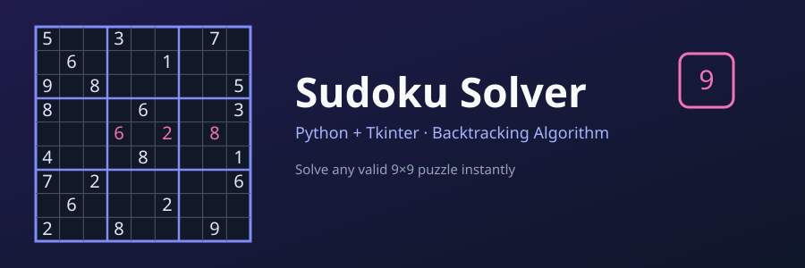

# 🧩 Sudoku Solver



A Python-based Sudoku Solver with a clean, user-friendly GUI built using **Tkinter**. Enter any valid 9x9 puzzle and watch it get solved instantly using a backtracking algorithm.


---

## 📌 Features

- 🖥️ Simple and clean graphical user interface (GUI)
- ✅ Solves any valid 9x9 Sudoku puzzle
- 🐍 Built entirely with Python and Tkinter
- 🔍 Includes error-checking to catch invalid entries
- 🔄 One-click reset functionality
- 🚪 Easy exit from the app window

---

## 🛠️ Technologies Used

| Component | Technology |
|---|---|
| **Language** | Python 🐍 |
| **GUI Framework** | Tkinter |
| **Solving Logic** | Backtracking algorithm |

---

## 📂 Project Structure

```
sudoku-solver/
├── sudoku_solver.py     # Main application file (GUI + solving logic)
├── README.md
└── requirements.txt     # (if any external dependencies are added)
```

---

## 🚀 Getting Started

### Prerequisites
- Python 3.x installed on your machine
- Tkinter (comes pre-installed with most Python distributions)

### Run the App

```bash
python "sudoku solver.py"
```

---

## 🎮 How to Use

1. **Launch** the app by running `sudoku solver.py` — you'll land on the welcome screen
2. Click **Start Sudoku Solver** to open the puzzle grid
3. **Enter** the known Sudoku numbers into the grid — leave empty cells blank
4. Click **Solve** to instantly fill in the completed puzzle
5. Click **Clear** to reset the grid and start a new puzzle
6. Click **Exit** to close the application

---

## 🧠 How It Works

The solver uses a classic **backtracking algorithm**:

1. Find the next empty cell in the grid.
2. Try placing digits `1–9` in that cell.
3. Check if the digit is valid — it must not already exist in the same row, column, or 3×3 sub-grid.
4. If valid, place it and recursively move to the next empty cell.
5. If no digit works, backtrack to the previous cell and try a different number.
6. Repeat until the entire grid is filled — or determine the puzzle is unsolvable.

This guarantees a correct solution for any valid Sudoku puzzle, exploring only promising paths and abandoning invalid ones early.

---

## 🖼️ Screenshots

### 👋 Welcome Screen


### 🔲 Puzzle Input


### ✅ Solved Puzzle


---

## 🔮 Future Improvements

- [ ] Add a difficulty-based puzzle generator
- [ ] Highlight conflicting cells in real time
- [ ] Add a step-by-step "visualize solving" animation
- [ ] Support saving/loading puzzles from file

---

## 📄 License

This project is open-source and available under the **MIT License**.

---

<p align="center">Made with ❤️ and a lot of backtracking 🧩</p>

